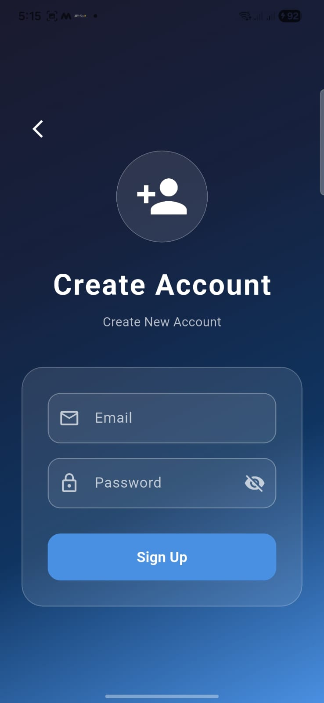
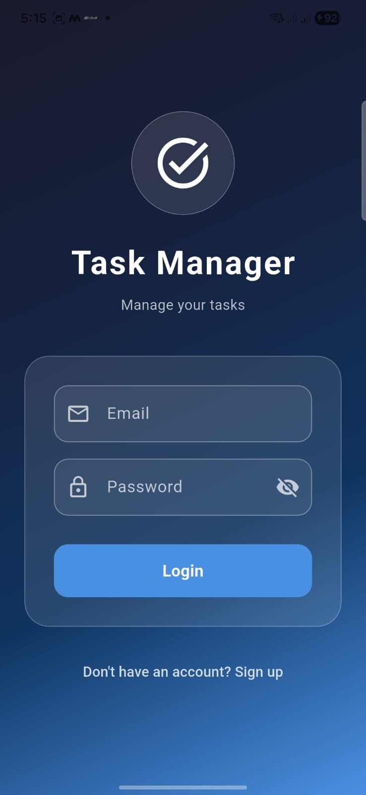
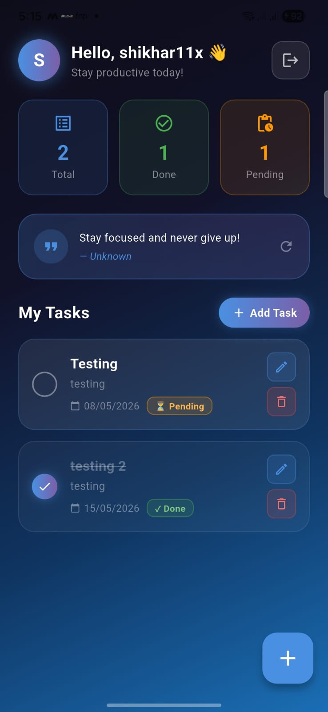
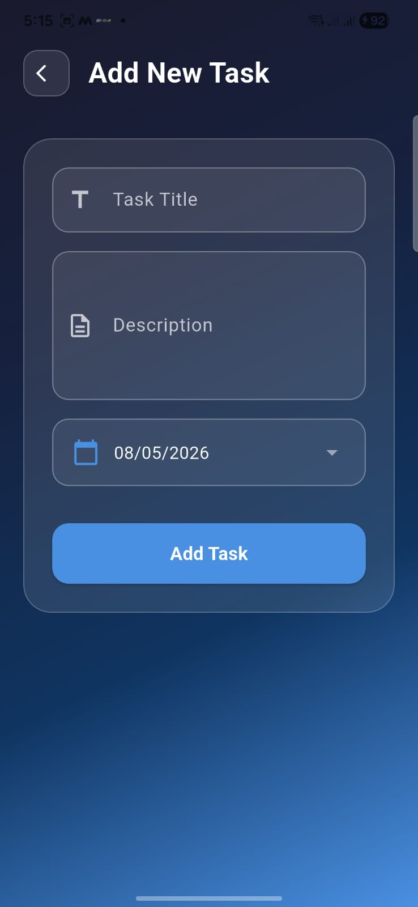

<div align="center">

# ✅ TaskFlow — Flutter Task Manager App

### *Stay focused. Stay productive. Never miss a task.*


</div>

---

## 📱 Screenshots

<table>
  <tr>
    <td align="center"><b>Sign Up</b></td>
    <td align="center"><b>Login</b></td>
    <td align="center"><b>Home</b></td>
    <td align="center"><b>Add Task</b></td>
  </tr>
  <tr>
    <td></td>
    <td></td>
    <td></td>
    <td></td>
  </tr>
</table>

## 🚀 Features

- 🔐 **Firebase Authentication** — Sign Up, Login & Logout
- 📋 **Task CRUD** — Add, Edit, Delete & Mark tasks as Done
- 💬 **Daily Motivation** — Fetches a fresh quote from Quotable API on every load
- 📊 **Task Stats** — See Total, Done & Pending counts at a glance
- 🎨 **Clean Dark UI** — Smooth gradients, glassmorphism cards, intuitive UX
- ⚡ **Real-time Sync** — Powered by Cloud Firestore streams

---

## 🏗️ Folder Structure

```
lib/
├── models/
│   └── task.dart              # Task data model
├── screens/
│   ├── login_screen.dart      # Login UI
│   ├── signup_screen.dart     # Sign Up UI
│   ├── home_screen.dart       # Dashboard with task list
│   ├── add_task_screen.dart   # Add new task
│   └── edit_task_screen.dart  # Edit existing task
├── services/
│   ├── auth_service.dart      # Firebase Auth logic
│   ├── firestore_service.dart # Firestore CRUD operations
│   └── quote_service.dart     # REST API — Quotable.io
├── widgets/                   # Reusable UI components
│   ├── app_background.dart      
│   ├── date_picker_field.dart     
│   ├── delete_dialog.dart       
│   ├── glass_container.dart
│   ├── glass_text_field.dart      
│   ├── gradient_button.dart     
│   ├── logout_button.dart       
│   ├── quote_card.dart
│   ├── stat_card.dart
│   ├── task_card.dart   
│   └── user_avatar.dart 
└── main.dart
```

---

## ⚙️ Setup & Installation


### 🔧 Step 1 — Clone the Repository

```bash
git clone https://github.com/your-username/taskflow-flutter.git
cd taskflow-flutter
```

### 📦 Step 2 — Install Dependencies

```bash
flutter pub get
```

### 🔥 Step 3 — Firebase Setup

1. Go to [Firebase Console](https://console.firebase.google.com/) and create a new project
2. Enable **Email/Password** under Authentication → Sign-in methods
3. Create a **Cloud Firestore** database (start in test mode)
4. Add an **Android App** to your Firebase project
   - Use your app's package name (e.g., `com.yourname.taskflow`)
   - Download `google-services.json` and place it in `android/app/`
5. *(Optional for iOS)* Add an iOS app and download `GoogleService-Info.plist` → place in `ios/Runner/`

### ▶️ Step 4 — Run the App

```bash
flutter run
```

To build a release APK:

```bash
flutter build apk --release
```

APK will be available at: `build/outputs/flutter-apk/app-release.apk`

---

## 🌐 API Used

**Motivational Quote API**
```
GET https://api.quotable.io/random
```

Response used:
```json
{
  "content": "Stay focused and never give up!",
  "author": "Unknown"
}
```

## 🛠️ Tech Stack

| Layer | Technology |
|---|---|
| Framework | Flutter + Dart |
| Auth | Firebase Authentication |
| Database | Cloud Firestore |
| REST API | Quotable.io |
| State | setState + StreamBuilder |
| Platform | Android & iOS |

---

## 📁 APK Download

> 📥 [Download Latest APK]([https://github.com/shikhar11x/flutter-Task-Manager-App/releases/tag/v1.0](https://github.com/shikhar11x/flutter-Task-Manager-App/releases/tag/v1.0))

---

## 🎥 Demo Video

> 🎬 [Watch Demo on YouTube / Drive](https://your-demo-link-here)

---

## 👨‍💻 Author

**Shikhar**

[](https://github.com/shikhar11x)

---

<div align="center">


</div>
